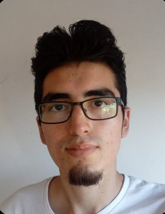
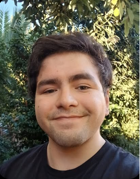
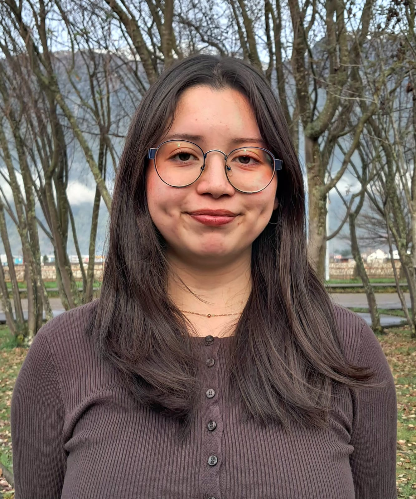
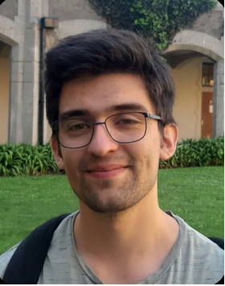

<!-- 1. BANNER PRINCIPAL -->

  

<!-- 2. RESUMEN BREVE DE CANELOS -->

    <h1 style="font-weight: 800; color: #222;">CANELOS 2026</h1>
    <h3 style="color: #47001e; margin-bottom: 20px;">CAD and Nanoelectronics Seminar</h3>

    
    

        Del 5 al 9 de octubre, la Universidad Técnica Federico Santa María (Valparaíso) será el punto de encuentro de la microelectrónica chilena y latinoamericana. CANELOS llega a su cuarta edición consolidado como el evento de diseño de circuitos integrados más grande de Chile, reuniendo a estudiantes, académicos, empresas del rubro e invitados internacionales en una misma instancia.
    

    

        El programa contempla tres días de talleres prácticos (5 al 7 de octubre) y dos días de seminario (8 y 9 de octubre), con charlas de figuras destacadas de la microelectrónica mundial, una sesión de student posters, presentaciones de centros de investigación, exhibiciones y un panel sobre el presente y futuro de la nanoelectrónica en Chile.
    

    

        No necesitas experiencia previa para participar, CANELOS está pensado tanto para quienes ya trabajan en el área como para quienes quieren descubrir cómo se diseñan los chips que mueven al mundo. Habrá instancias para todos los niveles, oportunidades de networking con la comunidad nacional e internacional. El evento cuenta con becas de transporte/alojamiento para estudiantes de regiones externas a la V región y del extranjero.
    

    

    Además, este año CANELOS abre su primer llamado a student posters: una convocatoria para que estudiantes de pregrado y postgrado presenten sus proyectos e investigaciones en microelectrónica ante la comunidad reunida en el evento. Los postulantes seleccionados podrán optar a becas de hasta USD $300 para financiar su transporte y alojamiento. ¡Prepara tu proyecto y postula!
    

<!-- 3. CHARLISTAS (FORMATO GRANDE CON TÍTULO A LA DERECHA) -->

    <h2 style="text-align: center; color: #47001e; font-weight: 700; margin-bottom: 40px;">Expositores Destacados</h2>
    

        CANELOS 2026 contará con charlistas de primer nivel provenientes de las sociedades del IEEE dedicadas a la microelectrónica: Solid-State Circuits Society (SSCS), Electron Devices Society (EDS) y Circuits and Systems Society (CASS), a través de sus programas de Distinguished Lecturers (DL e iDL), que llevan a los expositores más reconocidos de cada área a audiencias alrededor del mundo. A ellos se suman invitados internacionales convocados directamente por la organización, completando un panel de expertos que rara vez coincide en un mismo escenario en Chile.
    

    

        Las charlas abarcan un espectro amplio de la disciplina: desde el diseño análogo y digital de circuitos integrados, pasando por nichos como los dispositivos implantables, hasta temáticas que van más allá del diseño de microchips. No necesitas ser diseñador de circuitos para encontrar una charla que tenga valor para tus intereses.
    

    <!-- Charlista 1 -->
    

        

            
            

                <h3 style="margin: 0 0 10px 0; font-size: 1.7em; color: #222;">Pedro Toledo</h3>
                
                <!-- Contenedor de las burbujas apiladas -->
                

                    
Presencial

                    
CASS iDL

                

                
            

        

        

            
"Nanoscale Digital-Based Analog Processing: Circuits and Systems Solutions for Emerging Applications and Technologies"

        

    

    
    <!-- Charlista 2 -->
    

        

            
            

                <h3 style="margin: 0 0 10px 0; font-size: 1.7em; color: #222;">Joel Gak</h3>
                
                <!-- Burbujas apiladas -->
                

                    
Presencial

                    
Invitado

                

                
            

        

        

            
"Desafíos y técnicas de diseño en implantables"

        

    

    
    <!-- Charlista 3 -->
    

        

            
            

                <h3 style="margin: 0 0 10px 0; font-size: 1.7em; color: #222;">Expositor 3</h3>
                
                <!-- Burbujas apiladas -->
                

                    
Por anunciar

                    
-

                

                
            

        

        

            
"Por Anunciar"

        

    

    
    <!-- Charlista 4 -->
    

        

            
            

                <h3 style="margin: 0 0 10px 0; font-size: 1.7em; color: #222;">Expositor 4</h3>
                
                <!-- Burbujas apiladas -->
                

                    
Por anunciar

                    
-

                

                
            

        

        

            
"Por Anunciar"

        

    

    
    <!-- Charlista 5 -->
    

        

            
            

                <h3 style="margin: 0 0 10px 0; font-size: 1.7em; color: #222;">Expositor 5</h3>
                
                <!-- Burbujas apiladas -->
                

                    
Por anunciar

                    
-

                

                
            

        

        

            
"Por Anunciar"

        

    

<!-- 4. CAMPAMENTOS / CURSOS -->

    <h2 style="text-align: center; color: #47001e; font-weight: 700; margin-bottom: 40px;">Talleres</h2>

    <h3 align="justify" style="font-size: 1.2em; line-height: 1.6; max-width: 1200px; margin: 0;">
		Durante los días previos al seminario, del 5 al 7 de octubre, CANELOS ofrecerá una serie de talleres prácticos para aprender y adquirir nuevas habilidades. Los talleres abarcarán distintas áreas de la microelectrónica, diseñados y armados para distintos perfiles y demográficas.  La intención es abrir un abanico de oportunidades variado, con talleres pensados para estudiantes de distintos intereses e incluso para escolares. Sin importar tu nivel de experiencia, habrá un espacio para que profundices tus conocimientos o des comienzo a tu ruta en la microelectrónica.
	</h3>
    
    <a href="{{ "/programa/#workshop" | relative_url }}" style="text-decoration: none; color: inherit; flex: 1; min-width: 300px;">
        

            <h3 style="margin-top: 0; color: #003002; font-size: 1.4em;">Taller 1</h3>
            
Diseño de Implantables

            
 - 

        

    </a>
    
    <a href="{{ "/programa/#workshop" | relative_url }}" style="text-decoration: none; color: inherit; flex: 1; min-width: 300px;">
        

            <h3 style="margin-top: 0; color: #003002; font-size: 1.4em;">Taller 2</h3>
            
Diseño de Circuitos Digitales

            
 - 

        

    </a>

<!-- 5. EQUIPO PROFESIONAL -->

    <h2 style="text-align: center; color: #47001e; font-weight: 700; margin-bottom: 40px;">Equipo Profesional</h2>

    
    

        
        <h3 style="margin: 0; font-size: 1.3em; color: #222;">Jorge Marin</h3>
        
Pontificia Universidad Católica de Valparaíso

    

    
    

        
        <h3 style="margin: 0; font-size: 1.3em; color: #222;">Christian Rojas</h3>
        
Universidad Técnica Federico Santa María

    

    
    

        
        <h3 style="margin: 0; font-size: 1.3em; color: #222;">Joel Gak</h3>
        
Universidad Católica del Uruguay

    

    

        
        <h3 style="margin: 0; font-size: 1.3em; color: #222;">Jorge Gomez</h3>
        
Universidad de los Andes

    

    

        
        <h3 style="margin: 0; font-size: 1.3em; color: #222;">Miguel Figueroa</h3>
        
Universidad de Concepción

    

    

        
        <h3 style="margin: 0; font-size: 1.3em; color: #222;">Victor Grimblatt</h3>
        
Managing Director at Synopsys

    

<!-- 6. MAPA E ITINERARIO -->
<h2 style="text-align: center; color: #47001e; font-weight: 700; margin-bottom: 40px;">Ubicación y Programa</h2>

    
    

        <h3 style="text-align: center; margin-bottom: 15px;">Sede del Evento</h3>
        <iframe src="https://www.google.com/maps/embed?pb=!1m18!1m12!1m3!1d3344.423019889505!2d-71.59858348427976!3d-33.03749448089332!2m3!1f0!2f0!3f0!3m2!1i1024!2i768!4f13.1!3m3!1m2!1s0x9689e0c69d80d1e3%3A0x6b24eb14b51c0993!2sUniversidad%20T%C3%A9cnica%20Federico%20Santa%20Mar%C3%ADa!5e0!3m2!1ses!2scl!4v1714000000000!5m2!1ses!2scl" width="100%" height="350" style="border:0; border-radius: 12px; box-shadow: 0 4px 10px rgba(0,0,0,0.1);" allowfullscreen="" loading="lazy" referrerpolicy="no-referrer-when-downgrade"></iframe>
        
Universidad Técnica Federico Santa María Av. España 1680, Valparaíso, Chile

    

    

        <h3 style="text-align: center; margin-bottom: 15px;">Itinerario Preventivo</h3>
        

            
        

    

<!-- 7. EQUIPO ESTUDIANTIL -->
<h2 class="reveal" style="text-align: center; color: #47001e; font-weight: 700; margin-bottom: 40px;">Equipo Estudiantil</h2>

    
    <!-- Estudiante 1 -->
    

        
        <h3 style="margin: 0; font-size: 1.3em; color: #222;">Felipe Illanes</h3>
        
Organizador

        

            <a href="mailto:correo@usm.cl" style="color: #666; text-decoration: none; font-style: italic;">felipe.illanes@usm.cl</a>
        

    

    <!-- Estudiante 2 -->
    

        
        <h3 style="margin: 0; font-size: 1.3em; color: #222;">Leonidas Sandoval</h3>
        
Co-organizador

        

            <a href="mailto:correo@usm.cl" style="color: #666; text-decoration: none; font-style: italic;">leonidas.sandoval@sansano.usm.cl</a>
        

    

    <!-- Estudiante 3 -->
    

        
        <h3 style="margin: 0; font-size: 1.3em; color: #222;">Daniel Quiroz</h3>
        
Gestor Asuntos Nacionales

        

            <a href="mailto:correo@usm.cl" style="color: #666; text-decoration: none; font-style: italic;">daniel.quirozl@usm.cl</a>
        

    

    <!-- Estudiante 4 -->
    

        
        <h3 style="margin: 0; font-size: 1.3em; color: #222;">Vicente Martinez</h3>
        
Tesorero

        

            <a href="mailto:correo@usm.cl" style="color: #666; text-decoration: none; font-style: italic;">vmartinezm@usm.cl</a>
        

    

    <!-- Estudiante 5 -->
    

        
        <h3 style="margin: 0; font-size: 1.3em; color: #222;">Josefa Pino</h3>
        
Community Manager

        

            <a href="mailto:correo@usm.cl" style="color: #666; text-decoration: none; font-style: italic;">josefa.pino@usm.cl</a>
        

    

    <!-- Estudiante 6 -->
    

        
        <h3 style="margin: 0; font-size: 1.3em; color: #222;">Sebastian Sanchez</h3>
        
Gestor Asuntos Internacionales

        

            <a href="mailto:correo@usm.cl" style="color: #666; text-decoration: none; font-style: italic;">sebastian.sanchezp@usm.cl</a>
        

    

<!-- 8. CODIGO DEL MODAL (LA IMAGEN EXPANDIDA) -->

  <a href="#!" class="cerrar">&times;</a>
  

