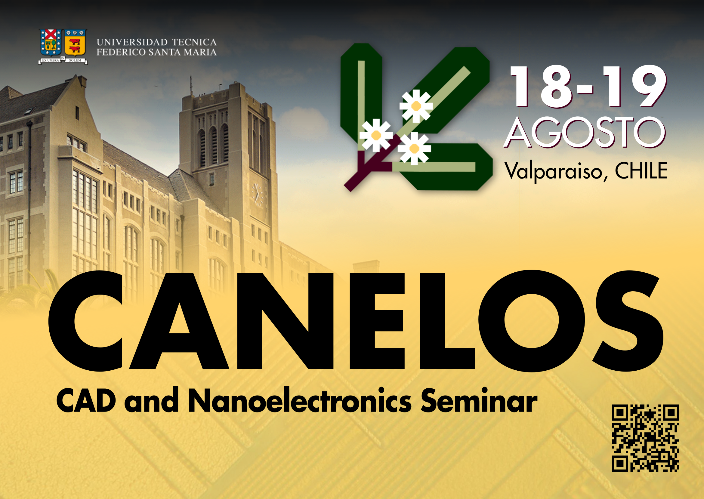

<h1 class="home-title"> CANELOS: CAD and Nanoelectronics Seminar </h1>
	
<h2 class="home-subtitle">Se viene la edición 2025 del mayor evento de microelectrónica y diseño de circuitos integrados de Chile.</h2>

<h3 class="home-subtitle" style="color: #47001e">¡Te esperamos el 18 y 19 de Agosto!</h3>
<!--
<h2 class="home-subtitle">No te pierdas el evento más importante de microelectrónica y diseño de circuitos integrados de Chile.</h2>

<h3 class="home-subtitle" style="color: #47001e">¡Inscríbete <a href="{{ "/registro/" | relative_url }}" style="color: #47001e; text-decoration:underline">aquí</a>!</h3>
-->

El seminario CANELOS tiene como principal objetivo reunir a la comunidad chilena de microelectrónica, fomentando su desarrollo técnico en torno a charlas de alto nivel
y generando un espacio para hacer contactos con la industria y la comunidad latinoamericana. 
Además, se busca promover la discusión sobre el crecimiento y futuro de la industria nacional de semiconductores.

  

 
CANELOS es una instancia organizada por <b>ChipUSM</b>, que es una asociación estudiantil de la Universidad Técnica Federico Santa María.

Los principales temas abordados incluyen: 

	

	 
	    
	

	   
	

		

		• Dispositivos y física nanométrica  
		• Sensado y acondicionamiento  	
		• Conversión energética y sistemas de potencia  		
		• Circuitos y sistemas de radiofrecuencia  	
		• Procesamiento de señales analógico y digital  	
		• Tecnologías de fabricación y testeo de circuitos integrados  	 
		• Herramientas de diseño asistido y automatización   	
		

	

<!--
El Secretario IEEE de ChipUSM, Sebastián Sánchez, ejerce como Chair de la edición 2024 de CANELOS. 
Además, este año contamos con la participación del <b>Capitulo Chileno de la Circuits And Systems Society</b> como co-anfitrión.

 

<h1 style="text-align: center"> Anfitriones </h1>

## ChipUSM

La asociación estudiantil ChipUSM nace en 2022 por voluntad de un grupo autoconvocado de estudiantes de la UTFSM interesados en microelectrónica.
Sus objetivos son fomentar el aprendizaje de la microelectrónica y su aplicación práctica en proyectos de diseño de circuitos integrados, 
promover la colaboración entre estudiantes y con entes externos en materia de microelectrónica, 
y ofrecer los medios técnicos y materiales que habiliten la participación de más estudiantes en el ámbito de los circuitos integrados.

Desde su fundación, ChipUSM ha jugado un rol importante difundiendo oportunidades, generando redes de contactos 
y valorizando el trabajo estudiantil en el desarrollo de la microelectrónica en la UTFSM y en Chile.

## Capítulo CAS del IEEE

El Capítulo profesional CAS es la instancia en Chile de la Circuits And Systems Society del Instituto de Ingenieros Eléctricos y Electrónicos (IEEE).
Este Capítulo, que reune a los profesionales del área de la microelectrónica del país, gestiona distintas actividades técnicas y profesionalizantes
mediante el trabajo voluntario de sus miembros y el apoyo de una basta red internacional. 
En particular, el Capítulo CAS permite realizar charlas de alto nivel técnico invitando a expertos de todo el mundo, como quienes exponen en CANELOS.

<h1 style="text-align: center"> Patrocinadores </h1>

## Instituto de Ingenieros Eléctricos y Electrónicos (IEEE)

El IEEE y sus sociedades hacen posible la realización de CANELOS mediante distintos fondos y beneficios que combinamos para el evento.
Además del apoyo y financiamiento del Capítulo CAS, contamos con los programas Distinguished Lecturer para costear viaje y estadía de charlistas expertos.
En esta oportunidad, recibiremos un charlista de la Electron Devices Society.

## Departamento de Electrónica de la UTFSM

El Departamento de Electrónica es la unidad académica de la Universidad Técnica Federico Santa María que está más estrechamente ligada al tema de la microelectrónica,
en investigación y docencia.
La Universidad y el Departamento, en particular, se complacen de apoyar instancias técnicas como CANELOS y valorar también el trabajo extracurricular de los y las
estudiantes de ChipUSM que organizan el evento.

## Ingeniería 2030 de la UTFSM

El programa ING2030, en el marco de su etapa de consolidación, pone a disposición de la comunidad universitaria los Fondos Concursables para el Fortalecimiento de
un Ecosistema de I+D+i+e. El seminario CANELOS es el segundo proyecto con que ChipUSM se adjudica fondos de dicho concurso.

## Centro AC3E

El Centro Avanzado de Ingeniería Eléctrica y Electrónica de las UTFSM es un centro basal multidisciplinario y con un importante enfoque
en transferencia tecnológica, para poner la investigación científica al servicio de la industria nacional y las sociedad.
En los últimos años, el AC3E ha desarrollado gran interés por la microelectrónica y busca potenciar sus capacidades de I+D en la materia.

## Synopsys

asdasd

<h1 style="text-align: center"> Colaboradores </h1>

## Rama IEEE de la UTFSM
La Rama Estudiantil es la instancia del IEEE en nuestra universidad, y como tal, persigue el desarrollo tecnológico al servicio de la humanidad.
Desde su rol de iniciativa estudiantil, la Rama busca complementar la formación ingenieril, tanto en el ámbito técnico como en desarrollo 
habilidades blandas y vocación de servicio.
La Rama contiene Capítulos Estudiantiles que persiguen un mayor nivel técnico en temas correspondientes a alguna de las sociedades del IEEE.
Entre los capítulos que existen en la UTFSM, destaca el nuevo Capítulo Estudiantil conjunto SSCS/CAS/EDS, especializado en microelectrónica.
-->